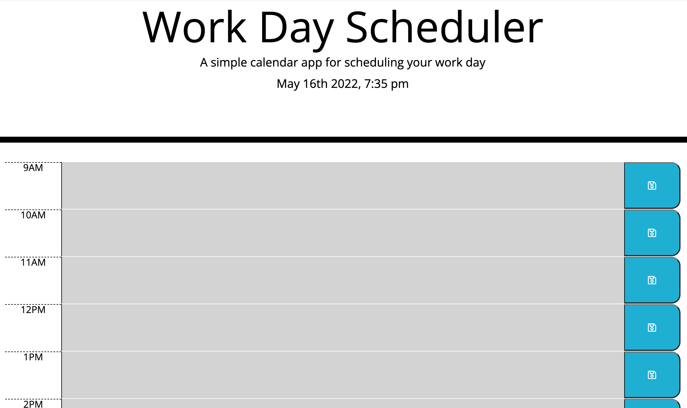

# Day Planner

## This is the repository for the day planner

### Overview

A day planner with timeblocks for standard business hours

### The user may:

1. input text in the textarea
2. save it with the save button
3. view the saved events even after refreshing the page
   

### Technologies used

1. HTML
2. CSS
3. JavaScript

### Link:

Click [https://angelawong3.github.io/day-planner/](https://angelawong3.github.io/day-planner/) to go to the page.

### License

### Contact Me

Please contact me at angelawong3@yahoo.com

---

© 2022 Angela Wong
